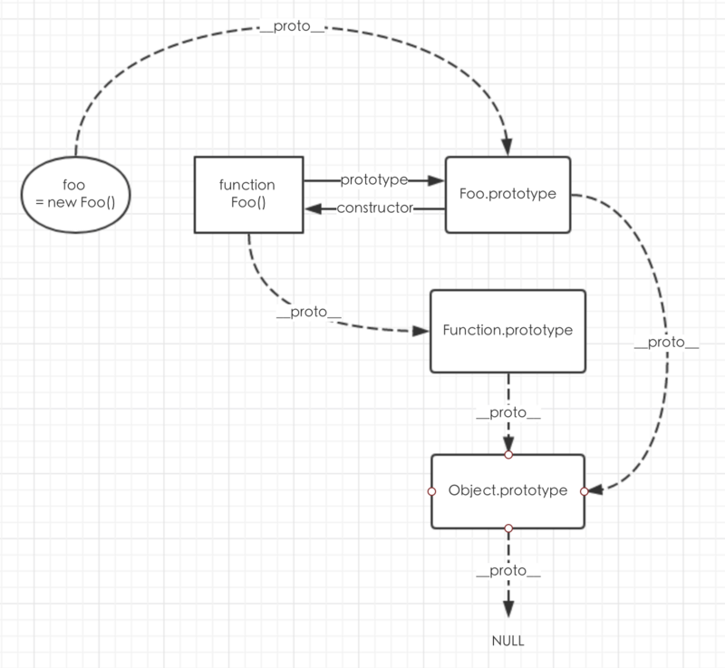

# JS挖坑填坑

##### Dom事件流（冒泡）

> 事件的3个阶段：捕获、目标、冒泡

| 捕获 | 事件从根节点流向目标节点，在各个节点上触发捕获事件，直到达到目标节点 |
| ---- | ------------------------------------------------------------ |
| 目标 | 事件到达目标节点时，就到了目标阶段，事件在目标节点上被触发   |
| 冒泡 | 事件在目标节点上触发后，不会终止，一层层向上冒，回溯到根节点 |

>  当我们在某个DOM节点绑定了某事件监听器，本来是想当该DOM节点触发事件，再执行回调函数。结果是该节点的某个子节点触发事件，由于事件冒泡，该DOM节点事件也会触发，执行了回调函数，这样就违背了最初的本意了。所以需要阻止冒泡。


```javascript
addEventListener("eventName", doSomething, false)
```

 第三个Boolean参数为true时, 表示是否在捕获阶段调用事件处理程序（老版dom），新版dom中第三个参数未option，可选很多参数，详见MDN。

###### 阻止冒泡

```javascript
function stopBubble(e) { 
//如果提供了事件对象，则这是一个非IE浏览器 
if ( e && e.stopPropagation ) 
    //因此它支持W3C的stopPropagation()方法 
    e.stopPropagation(); 
else 
    //否则，我们需要使用IE的方式来取消事件冒泡 
    window.event.cancelBubble = true; 
}
//vue中有修饰符.stop
```

###### 阻止默认行为

```javascript
//阻止浏览器的默认行为 
function stopDefault( e ) { 
    //阻止默认浏览器动作(W3C) 
    if ( e && e.preventDefault ) 
        e.preventDefault(); 
    //IE中阻止函数器默认动作的方式 
    else 
        window.event.returnValue = false; 
    return false; 
}
```

##### 继承

###### ES5 原型链

[_proto与prototype](https://segmentfault.com/a/1190000011801127)

[阮一峰](https://wangdoc.com/javascript/oop/prototype.html)




```javascript
function Game(name) {
  this.name = name;
}
Game.prototype.color = 'white';

var game1 = new Game('fly');
var game2 = new Game('mov');

cat1.color // 'white'
cat2.color // 'white'
```


###### ES6 class

```javascript
class Point {
}

class ColorPoint extends Point {
}
```


##### 图片在手机跨域问题

> 图片能正常显示，但用在高德的imagelayer接口作为参数传入时不行（用Import引入可以用，但调用接口获取url传入不行）。

###### 解决办法

用image对象，转换base64，并且在img对象中设置

```javascript
 imgObj.crossOrigin="anonymous";     //允许跨域
 imgObj.src = imgUrl+ '?time=' + new Date().valueOf();  //为图片地址添加时间戳参数（添加别的参数好像也行）
```

完整代码

```javascript
  const b64Img = await getBase64Img(this.mapUrl);
            let imageLayer = new AMap.ImageLayer({
                opacity: 1,
                url: b64Img,
                bounds: new AMap.Bounds(
                    [that.southWest.split(',')[0], that.southWest.split(',')[1]],
                    [that.northEast.split(',')[0], that.northEast.split(',')[1]]
                ),
                zooms: [10, 13] // 设置可见级别，[最小级别，最大级别]
            });
            map.add(imageLayer);

export default (imgUrl) => {
    return new Promise(function(resolve, reject) {
        let imgObj = new Image();
        imgObj.crossOrigin="anonymous";
        imgObj.src = imgUrl+ '?time=' + new Date().valueOf();
        imgObj.onload = function(){
            const canvas = document.createElement('canvas');
            canvas.width = imgObj.width;
            canvas.height = imgObj.height;
            const ctx = canvas.getContext("2d");
            ctx.drawImage(imgObj, 0, 0, imgObj.width, imgObj.height);
            const b64Str = canvas.toDataURL("image/png");
            resolve(b64Str);
        };
        imgObj.onerror = (e)=>{
            reject(e)
        }
    })
}
```

##### 防止重复点击

> 起因：项目中，点击事件会触发调用接口。为了防止用户抽风狂点按钮导致的重复事件，定义一个全局变量来控制。

###### 简单方法

```javascript
this. isCall=true;
//click function
click(){
if(!isCall){
return
}
this.isCall=false;
this.call();
}

//call function
call(){
ajax.send();
this.isCall=true;
}


```

###### 防抖

> 防抖动和节流本质是不一样的。防抖动是将多次执行变为最后一次执行，节流是将多次执行变成每隔一段时间执行。


```javascript
// func是用户传入需要防抖的函数
// wait是等待时间
const debounce = (func, wait = 50) => {
  // 缓存一个定时器id
  let timer = 0
  // 这里返回的函数是每次用户实际调用的防抖函数
  // 如果已经设定过定时器了就清空上一次的定时器
  // 开始一个新的定时器，延迟执行用户传入的方法
  return function(...args) {
    if (timer) clearTimeout(timer)
    timer = setTimeout(() => {
      func.apply(this, args)
    }, wait)
  }
}
// 不难看出如果用户调用该函数的间隔小于wait的情况下，上一次的时间还未到就被清除了，并不会执行函数
```


```javascript
// 这个是用来获取当前时间戳的
function now() {
  return +new Date()
}
/**
 * 防抖函数，返回函数连续调用时，空闲时间必须大于或等于 wait，func 才会执行
 *
 * @param  {function} func        回调函数
 * @param  {number}   wait        表示时间窗口的间隔
 * @param  {boolean}  immediate   设置为ture时，是否立即调用函数
 * @return {function}             返回客户调用函数
 */
function debounce (func, wait = 50, immediate = true) {
  let timer, context, args

  // 延迟执行函数
  const later = () => setTimeout(() => {
    // 延迟函数执行完毕，清空缓存的定时器序号
    timer = null
    // 延迟执行的情况下，函数会在延迟函数中执行
    // 使用到之前缓存的参数和上下文
    if (!immediate) {
      func.apply(context, args)
      context = args = null
    }
  }, wait)

  // 这里返回的函数是每次实际调用的函数
  return function(...params) {
    // 如果没有创建延迟执行函数（later），就创建一个
    if (!timer) {
      timer = later()
      // 如果是立即执行，调用函数
      // 否则缓存参数和调用上下文
      if (immediate) {
        func.apply(this, params)
      } else {
        context = this
        args = params
      }
    // 如果已有延迟执行函数（later），调用的时候清除原来的并重新设定一个
    // 这样做延迟函数会重新计时
    } else {
      clearTimeout(timer)
      timer = later()
    }
  }
}
```

这里的`apply`是指向window的。因为 sayHi 函数定义在全局中，所以调用时里面this指向window，
所以才需要加上 apply，显示绑定 this 值(input对象)到 sayH 函数里面去。这里的箭头函数依旧是指向 input 对象。


###### 节流

```javascript
/**
 * underscore 节流函数，返回函数连续调用时，func 执行频率限定为 次 / wait
 *
 * @param  {function}   func      回调函数
 * @param  {number}     wait      表示时间窗口的间隔
 * @param  {object}     options   如果想忽略开始函数的的调用，传入{leading: false}。
 *                                如果想忽略结尾函数的调用，传入{trailing: false}
 *                                两者不能共存，否则函数不能执行
 * @return {function}             返回客户调用函数
 */
_.throttle = function(func, wait, options) {
    var context, args, result;
    var timeout = null;
    // 之前的时间戳
    var previous = 0;
    // 如果 options 没传则设为空对象
    if (!options) options = {};
    // 定时器回调函数
    var later = function() {
      // 如果设置了 leading，就将 previous 设为 0
      // 用于下面函数的第一个 if 判断
      previous = options.leading === false ? 0 : _.now();
      // 置空一是为了防止内存泄漏，二是为了下面的定时器判断
      timeout = null;
      result = func.apply(context, args);
      if (!timeout) context = args = null;
    };
    return function() {
      // 获得当前时间戳
      var now = _.now();
      // 首次进入前者肯定为 true
	  // 如果需要第一次不执行函数
	  // 就将上次时间戳设为当前的
      // 这样在接下来计算 remaining 的值时会大于0
      if (!previous && options.leading === false) previous = now;
      // 计算剩余时间
      var remaining = wait - (now - previous);
      context = this;
      args = arguments;
      // 如果当前调用已经大于上次调用时间 + wait
      // 或者用户手动调了时间
 	  // 如果设置了 trailing，只会进入这个条件
	  // 如果没有设置 leading，那么第一次会进入这个条件
	  // 还有一点，你可能会觉得开启了定时器那么应该不会进入这个 if 条件了
	  // 其实还是会进入的，因为定时器的延时
	  // 并不是准确的时间，很可能你设置了2秒
	  // 但是他需要2.2秒才触发，这时候就会进入这个条件
      if (remaining <= 0 || remaining > wait) {
        // 如果存在定时器就清理掉否则会调用二次回调
        if (timeout) {
          clearTimeout(timeout);
          timeout = null;
        }
        previous = now;
        result = func.apply(context, args);
        if (!timeout) context = args = null;
      } else if (!timeout && options.trailing !== false) {
        // 判断是否设置了定时器和 trailing
	    // 没有的话就开启一个定时器
        // 并且不能不能同时设置 leading 和 trailing
        timeout = setTimeout(later, remaining);
      }
      return result;
    };
  };
```

#### 移动端没有原生的拖动事件

drag事件仅仅支持pc端，简单情况可以用touch事件替换。复杂一点可以用vue-dragging组件。

#### 获取dom

```javascript
 getElementById 
 getElementsByClassName  TagName 
 querySelectorAll 
 querySelector 
```

#### jquery调用接口

```javascript
jquery ajax拼接token到request-header
  $.ajax({
                        headers:{
                            "access_token":this.token
                        },
                        url: "https://new.icity24.xyz/openlock-shiyan/findArea/getArea",
                        dataType: "json", //服务器返回json格式数据
                        type: "post", //HTTP请求类型
                        timeout: 10000, //超时时间设置为10秒；
                        contentType: "application/x-www-form-urlencoded",
                        data: {
                            area: this.location,
                            name: this.inputVal
                        },
                        success: function (resp) {
                            if (resp.data.length > 0) {
                                ctx.isList = true
                            } else {
                                ctx.isList = false;
                                ctx.isEmpty = true;
                            }
                            ctx.compamyList = resp.data
                        },
                        error: function (err) {
                            console.log("err", err);
                            loading.hide();
                            ctx.$imui.toast.show("第三方接口异常", 1000);
                        }
                    });

```

#### Date对象

 date对象的问题，date对象返回的时间都是通用协调时(UTC, Universal Time Coordinated)。UTC与格林尼治平均时(GMT, Greenwich Mean Time)一样，都与英国伦敦的本地时相同。比北京时间慢了8个小时。

 输入就输入本地时间，他会自动转换为UTC时间。 

注意IOS不能 使用new Date(2019-01-02),会显示NaN，直接new Date 获取此时时间，或者用/。 

#### return break continue

#####  return用于if或者函数中

用了return就终止执行，跳出大圈，后面的代码都不会执行。

return; return true;return false;

##### break continue用于退出循环或者在switch语句中跳出case

```javascript
for(let i=0;i<10;i++){
    if(i===6){
      break;
    }
    console.log(i)
}
console.log("end")
//012345end                     break只是退出循环，并不会终止后面代码的执行
```

```javascript
for(let i=0;i<10;i++){
    if(i===6){
      return;
    }
    console.log(i)
}
console.log("end")
//012345                        rerurn终止了后面代码的执行
```


```javascript
for(let i=0;i<10;i++){
    if(i===6){
      continue;
    }
    console.log(i)
}
console.log("end")
//012345789end 不输出6           continue退出循环后又接着循环执行
```

```javascript
//不加break就会全部输出，起不到选择的作用
switch (x) {
  case 1:
    console.log('x 等于1');
    break;
  case 2:
    console.log('x 等于2');
    break;
  default:
    console.log('x 等于其他值');
}
                             switch中
```

#### 属性名

```javascript
properties[someName]
```

> 对象属性的特殊写法，当属性名是变量（不确定是哪个字符串）的时候需要这么写，因为`properties.someName`的写法要求`someName`是字符串