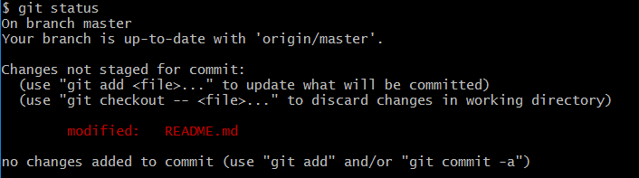
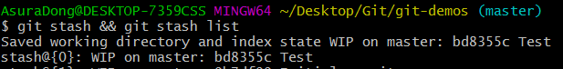
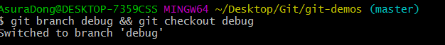
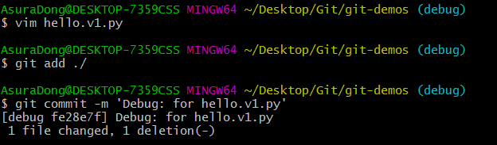
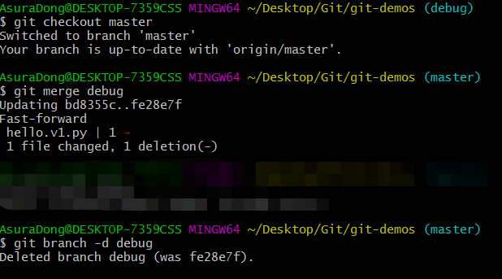
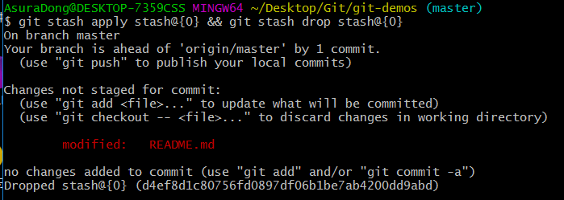

# git常用整理

### git

-  #### git教程

​       [git官方文档](https://git-scm.com/docs)
​       [git廖雪峰](https://www.liaoxuefeng.com/wiki/896043488029600)
​       [git工作流](https://github.com/xirong/my-git/blob/master/git-workflow-tutorial.md)

- #### 流程

  工作区(working tree)—暂存区(stage)—版本库（master分支）—远程库(remote)

  working is clean (工作区没东西，一般是add之后，东西都放入暂存区了)

  untracked(未添加到工作区（add），没有被跟踪)

  not staged（未添加到暂存区，没有被暂存）

- #### git 操作

  ##### 初始化

  | 命令                                              | 作用        |
  | ------------------------------------------------- | ----------- |
  | `git init`                                        | 初始化      |
| `git config -g user.name "clark-cui"`             | 全局git名   |
  | `git config -g user.email "cuirongchuan@163.com"` | 全局git邮箱 |
  
  > 若想某个项目单独使用一个账户，可以在该项目中使用不带`g`的命令设置
##### 常用操作

| 命令                            | 作用                                                         |
| ------------------------------- | ------------------------------------------------------------ |
| `git clone https://... e:/code` | (webstorm--vcs--checkout from version control--git)          |
| `git add .`                     | 把工作时的所有变化提交到暂存区，包括文件内容修改(modified)以及新文件(new)，但不包括被删除的文件 |
| `git add -u(update)`            | 仅监控已经被add的文件（即tracked file），他会将被修改的文件提交到暂存区。不会提交新文件（untracked file）,但会提交已被删除的文件 |
| `git add -A(All)`               | 上面两个功能的合集，会提交新文件和已被删除的文件             |
| `git rf`                        | 删除暂存区某文件（用git add .重新add会自动忽略已删除文件）   |
| `git commit -m""`               | 添加commit                                                   |
| `git pull origin master`        | 拉代码                                                       |
| `git push origin master`        | 提交代码                                                     |

##### 版本

| 命令                                    | 作用                                                         |
| --------------------------------------- | ------------------------------------------------------------ |
| `git status`                            | 检查当前状态                                                 |
| `git diff`                              | 查看修改内容                                                 |
| `git log`                               | 获取历史修改记录（版本号）                                   |
| `git log --pretty=online`               | 使得历史记录只显示主要内容，一行显示                         |
| `git reflog`                            | 可以查看所有分支的所有操作记录（包括已经删除的commit记录和reset记录，可以吃后悔药） |
| `git reset --hard 版本号`               | 回退到对应版本                                               |
| `git reset --hard HEAD ~100`            | 回退到前100个版本                                            |
| `git remote get-url origin`             | 获取远程url                                                  |
| `git remote add origin https://...`     | 第一次设置git远程仓库                                        |
| `git remote set-url origin https://...` | 重新设置git远程仓库                                          |


##### 分支

| 命令                               | 作用                                   |
| ---------------------------------- | -------------------------------------- |
| `git branch`                       | 显示所有本地分支（并查看当前所属分支） |
| `git branch -r`                    | 显示所有远程分支                       |
| `git branch -a`                    | 显示所有本地和远程分支                 |
| `git branch  [branch-name]`        | 新建一个分支，但依然停留在当前分支     |
| `git checkout -b [branch-name]`    | 新建一个分支，并切换到该分支           |
| `git checkout [branch-name]`       | 切换到指定分支，并更新工作区           |
| `git checkout -`                   | 切换到上一个分支                       |
| `git merge [branch-name]`          | 合并指定分支到当前分支                 |
| `git branch -d [branch-name]`      | 删除本地分支                           |
| `git push origin -d [branch-name]` | 删除远程分支                           |


#####   标签

| 命令                                   | 作用                                  |
| -------------------------------------- | ------------------------------------- |
| `git tag`                              | 查看所有标签                          |
| `git tag <tagname>`                    | 创建标签：tagname                     |
| `git tag -a <tagname> -m <comment>`    | 为标签 tagname 增加说明 comment       |
| `git show <tagname>`                   | 查看标签：tagname 的内容              |
| `git tag -d <tagname>`                 | 删除标签：tagname                     |
| `git tag <tagname> -m <comment>`       | 创建标签 tagname 并且增加说明 comment |
| `git push origin --tags`               | 推送所有标签                          |
| `git push origin <tagname>`            | 推送指定标签                          |
| `git push origin :refs/tags/<tagname>` | 删除远程标签                          |

> 当一个代码仓库进过长时间的迭代，针对不同的时期和需求，必定会有不同的版本。而借助 Git 提供的标签功能，可以快捷方便地记录代码版本。无论什么时候，想取回某个版本，不再需要查找冗长的`commit_id`，只需要取出打标签的历史版本即可。

可以这么理解：**标签是版本库的一个快照**。在主流的 Git 平台上，版本可以直接下载的，节省了开发者的不少精力。

例如

```javascript
git tag v1.0.0 -m 'v1.0.0正式版本'
```

在github上显示在releases标签里面,点进去，会发现我们可以直接下载`v1.0.0`版本。所以，标签是版本的快照。

值得一提的是：**标签会随着git clone仓库时候，自动拉取到本地**。不信的话可以 clone 一下这个代码仓库，查看是不是已经有了`v1.0.0`这个标签。

版本管理可以借助 git 的 tag 来实现。但是，在开发过程中，不可能每次修改都打标签然后发布。

实际开发中，**一般会有一个`dev`分支，作为开发版本分支**。在没有完成此次开发任务前，所有的代码都是合并到`dev`分支。

当完成了开发任务，管理者会将`dev`分支合并到`master`分支，然后删除`dev`分支，并且通过打标签来发布版本。

这就是为什么很多放弃维护的大型开源项目只有`master`分支的原因。

##### 隐藏

| 命令                   | 作用                                                       |
| ---------------------- | ---------------------------------------------------------- |
| `git stash`            | 隐藏当前的工作现场, 此时, `git status`的结果是 `clean`     |
| `git stash list`       | 查看所有隐藏, 每一行的冒号前面的字符串就是标识此隐藏的`id` |
| `git stash apply <id>` | 重新显示标识为 id 的隐藏                                   |
| `git stash drop <id>`  | `git apply`恢复隐藏后, 需要手动删除 list 列表中的记录      |
| `git stash pop`        | Apply last stash and remove it from the list               |

> 在实际项目开发中，总会遇到代码写到一半（没法去打`commit`），去开启新的分支 修复 Bug 或者 增加功能 的情况。如果不处理，未修改的代码就会被带入临时创建的新的分支，没写完的代码 和 要修复的代码混合在一起，绝对苦逼。而 Git 中的`stash`就是用来对付这种情况。

`stash`在英文中的意思是：隐藏。在 Git 代码管理的过程中，它的作用也是隐藏没完成的代码，防止它干扰 别人 或者 新分支的工作。

###### 试一试

假设：正当我在 master 分支上写着文档时候（*没有完成、没有提交*），同事发现 `hello.py` 这个脚本有问题，紧急报告给我进行修复。

收到报告，下意识就是开一个 debug 分支来处理 bug。但是，现在的文档没完成，自然无法提交，又不能把没提交的东西带入到新创建的 debug 分支（*执意如此，我也没办法 : )*）。目前，status 如下：




为了达到目的，分为以下几步：

1. 隐藏修改：`git stash` : 

   
   
   

2.创建新分支：`git branch debug` : 





3.在`debug`分支上修复 bug, 并且将修改添加到 log 中 : 




4.回到`master`分支, 合并`debug`分支的修改, 并且删除 `debug` 分支 : 




5.重新显示隐藏的`stash`，并且将其从`stash list`列表中删除 : 




6.完成。第五步的两条命令可以用`git stash pop`,第二部可以用`git checkout -b debug`

> 在实际生产过程中，难免会遇到多个 stash 的情况。此时，他们的 id 默认都是：`stash{0}`, `stash{1}`, `stash{2}` ... ...
>
> 当我们恢复一个 stash ，并且将它从 stash list 中移除的时候，在其下方的 stash 记录的 id 会自动变小，以保证 id 是从 0 到 n 的连续自然数列。**所以，当从 stash list 移除一个 stash 后，一些 stash 的 id 就会发生改变**。此处是个坑。